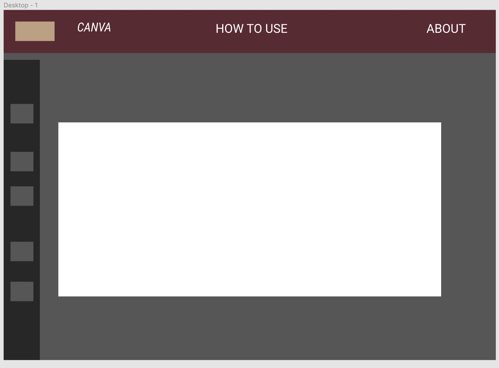

# Project Overview

## Canvas

## Wireframes

### MVP/PostMVP

#### MVP 
1. Create interface that allows users to 'paint'
2. Have different brush sizes
3. Have a full range of colors
4. Have an eraser

#### PostMVP  

1. Have a feature where the paint 'drips'
2. Have a magnifying glass

## Project Schedule

|  Day | Deliverable | Status
|---|---| ---|
|Week 1| Research: Learn React Native, how to create paint simulation with JavaScript  | Incomplete
|Week 2| Build and test interface | Incomplete
|Week 3| Misc: pseudocode/ responsitivity/ refactoring | Incomplete
|Week 4| MVP | Incomplete

## Priority Matrix 

## Timeframe

| Component | Priority | Estimated Time | Time Invested | Actual Time |
| --- | :---: |  :---: | :---: | :---: |
| Research React Native | Moderate | 2hrs | n/a | n/a  |
| Research Painting | Moderate | 1hr|n/a | n/a  |
| Create React App without Painting Interface | Moderate | 3hrs| n/a | n/a  |
| Create Painting Interface |High | 3hrs|n/a | n/a  |
| Debugging the code | H | 3hrs| n/a | n/a  |
| Add in pseudocode | Low | 1hrs|n/a | n/a  |
| Work on responsitivity | Moderate | 4hrs| n/a | n/a  |
| Refactor code | Moderate | 2hrs| n/a | n/a  |
| Total | H | 19 hrs|n/a | n/a  |

## Code Snippet

## Change Log
  